# helmholtz-PINN-experiments

> ⚠️ **Personal and exploratory repository.**
> The scripts in this repository were written for learning purposes. The results do not claim to represent any physical reality and do not constitute research work. This repository is shared for intellectual purposes only.

---

## Overview

This repository gathers experiments with **Physics-Informed Neural Networks (PINNs)** applied to two classical PDEs: the **Helmholtz equation** and a **1D wave scattering problem**.

All models use a **SIREN** (*Sinusoidal Representation Network*) architecture, whose sinusoidal activations are well-suited for learning oscillatory solutions. Training combines two optimizers: **Adam** first, followed by **L-BFGS** for fine-grained convergence.

---

## Repository structure

```
├── DIFFUSION_1D.py              # 1D scattering by a dielectric slab
├── DIFFUSION_1D_fn.py           # Refactored version with functions
├── HELM_PINN_1D.py              # 1D Helmholtz with Gaussian source
├── HELM_PINN_1D_loop.py         # 1D Helmholtz looped over k (error study)
├── HELM_PINN_2D.py              # 2D Helmholtz with Gaussian source
├── HELM_PINN_2D_fn.py           # Refactored 2D version
├── DIFFUSION_1D_results/        # 1D scattering results
├── HELM_PINN_1D_results/        # 1D Helmholtz results
└── HELM_PINN_2D_results/        # 2D Helmholtz results
```

---

## Scripts

### `DIFFUSION_1D.py` — 1D Scattering by a dielectric slab

**Physical setup.** An incident plane wave `e^(ikx)` propagates from left to right and hits a dielectric slab with refractive index `n_d = 1.5`, located between `x = 0.35` and `x = 0.65`. At each interface, part of the wave is reflected and part is transmitted. The problem is governed by the heterogeneous Helmholtz equation:

```
u_xx + k² n²(x) u = source
```

The total field is split into the known incident field and the unknown scattered field (`u_total = u_inc + u_scat`). The PINN learns only the scattered field, decomposed into real and imaginary parts (`p` and `q`). Absorbing boundary conditions (Sommerfeld) are imposed at both ends to simulate an open domain.

**Reference.** The exact analytical solution is derived by enforcing continuity of the field and its derivative at both slab interfaces, leading to a 4×4 linear system for the reflection and transmission coefficients.

**Parameters:** `k = 10`, `n_d = 1.5`, domain `[0, 1]`.

**Results:**

| k = 5 | k = 10 |
|:---:|:---:|
| 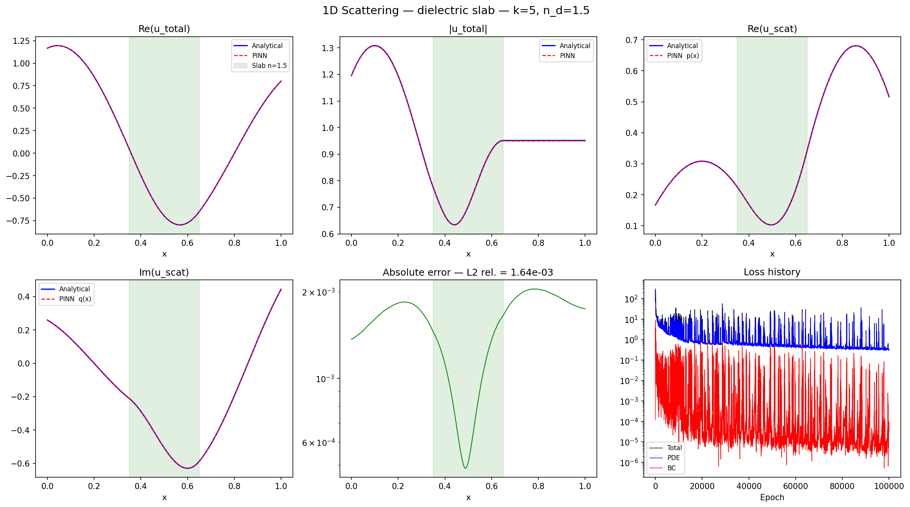 | 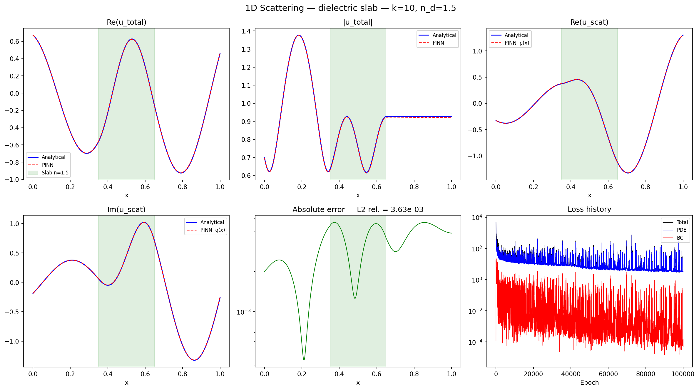 |

| k = 15 | k = 20 |
|:---:|:---:|
| 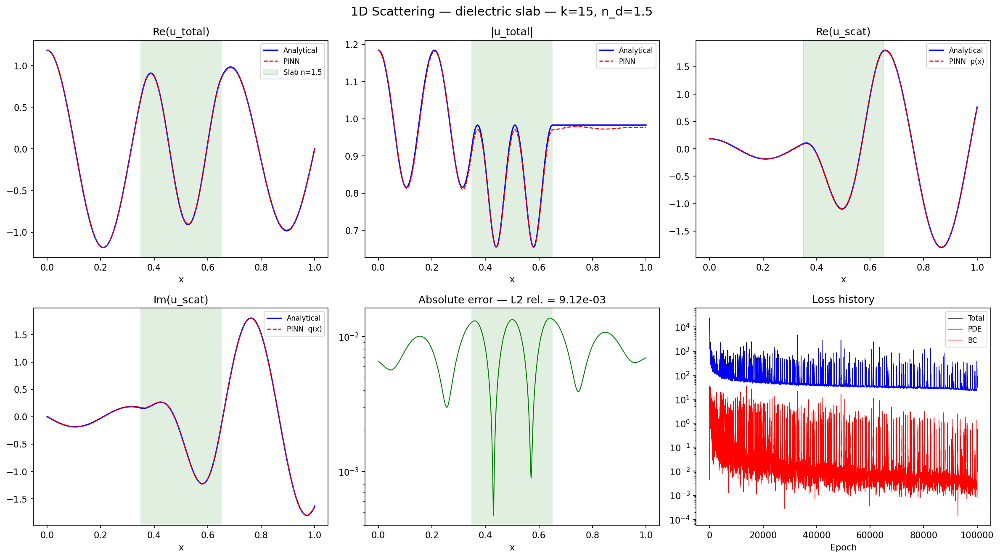 | 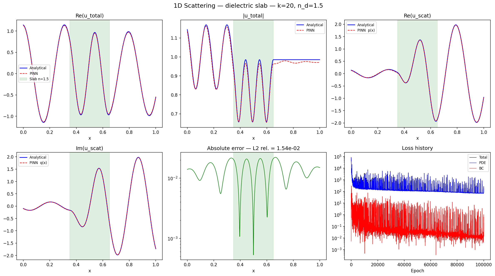 |

Each panel shows: real part of total field, modulus, scattered field (real and imaginary), pointwise error, and training loss history.

---

### `HELM_PINN_1D.py` — 1D Helmholtz with a localized source

**Physical setup.** The stationary Helmholtz equation on a segment:

```
u_xx + k² u = f(x)
```

with homogeneous Dirichlet conditions (`u(0) = u(1) = 0`) and a Gaussian source `f` centered at `x = 0.5`. This equation describes, for example, the steady-state response of a forced vibrating string, or more generally linear acoustics in the harmonic regime. At large `k`, the solution oscillates rapidly — a well-known challenge for PINNs (*spectral bias*).

**Reference.** The reference solution is computed by finite differences using a sparse scipy solver.

**Parameters:** `k = 100`, domain `[0, 1]`, 5000 collocation points.

---

### `HELM_PINN_1D_loop.py` — Error vs. wavenumber study

**Physical setup.** Same problem as above, with `k` varying from 10 to 100 in steps of 10. The goal is to observe how PINN accuracy degrades as frequency increases.

**Results:**

<table>
<tr>
<td>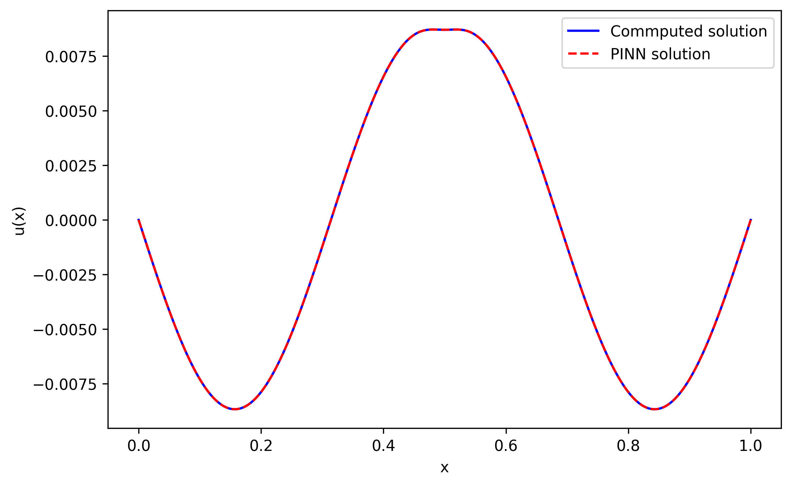<br><em>k = 10</em></td>
<td>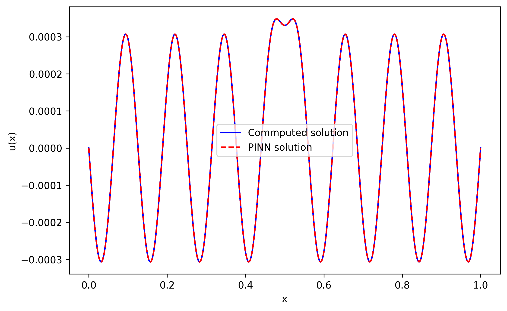<br><em>k = 50</em></td>
<td>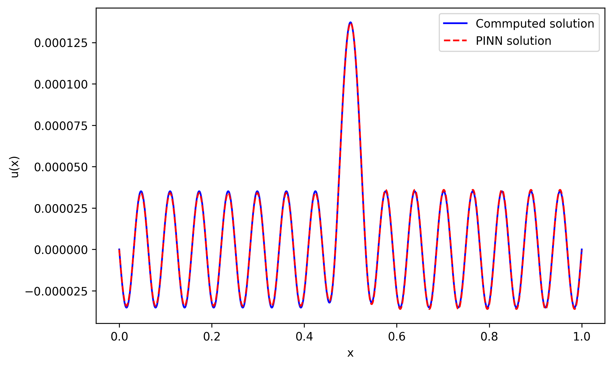<br><em>k = 100</em></td>
</tr>
</table>

**L2 error as a function of k:**

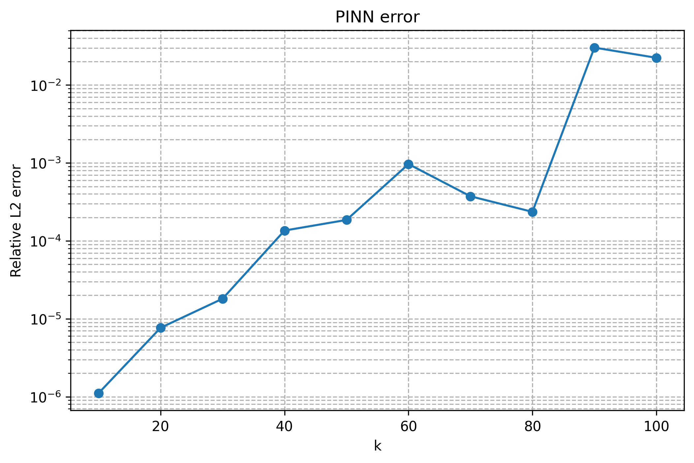

---

### `HELM_PINN_2D.py` — 2D Helmholtz equation

**Physical setup.** Extension to a 2D domain: solving

```
Δu + k² u = f(x, y)
```

on the unit square `[0,1]²` with homogeneous Dirichlet conditions on all boundaries and a Gaussian source centered at `(0.5, 0.5)`. This models, for instance, the acoustic pressure in a closed rectangular cavity excited by a point source in the harmonic regime.

**Reference.** The reference solution is computed by 2D finite differences on a 500×500 grid, solved via a sparse linear system.

**Parameters:** `k = 20`, domain `[0,1]²`, mini-batch training (4000 points per step).

**Results:**

| k = 5 | k = 10 | k = 20 |
|:---:|:---:|:---:|
| 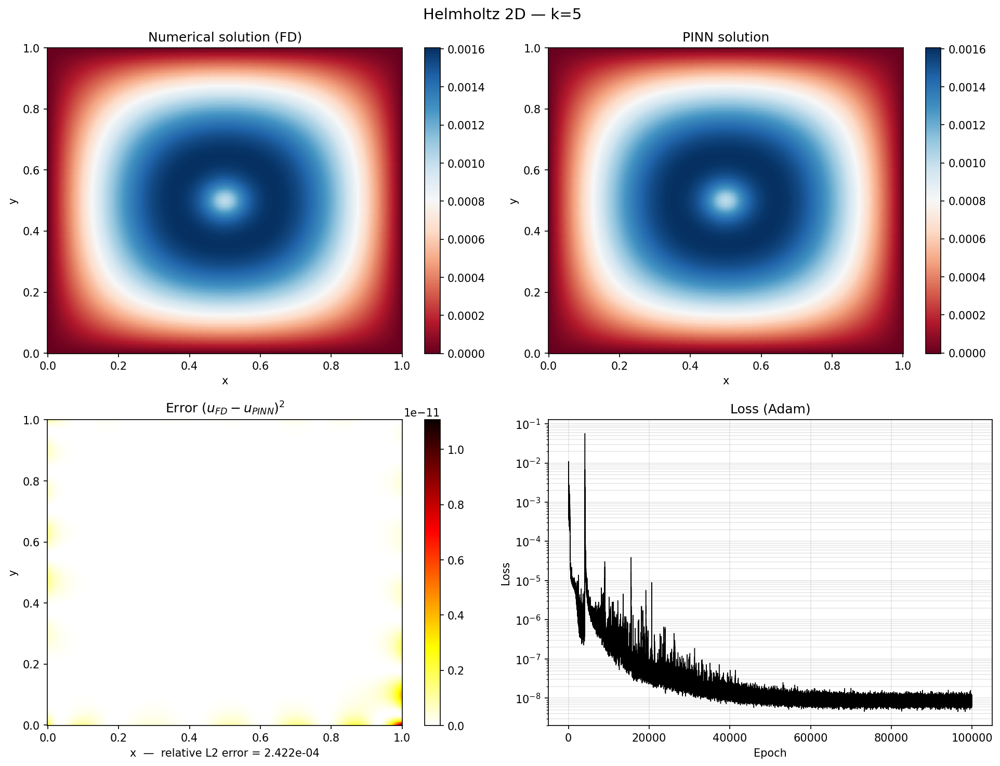 | 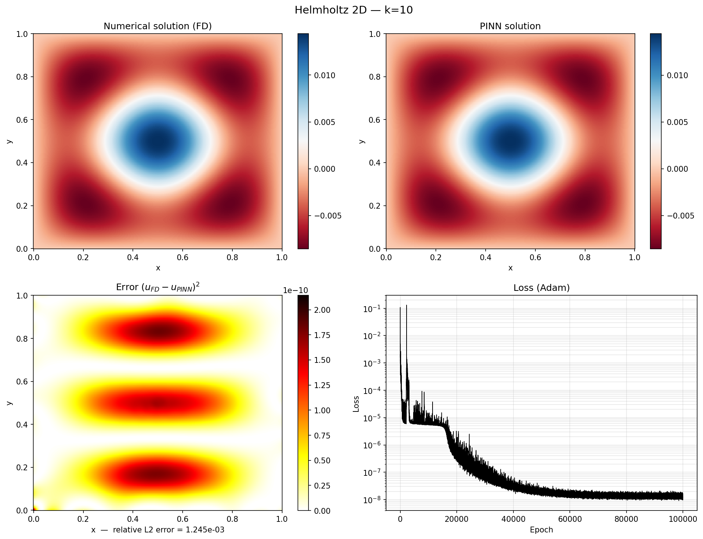 | 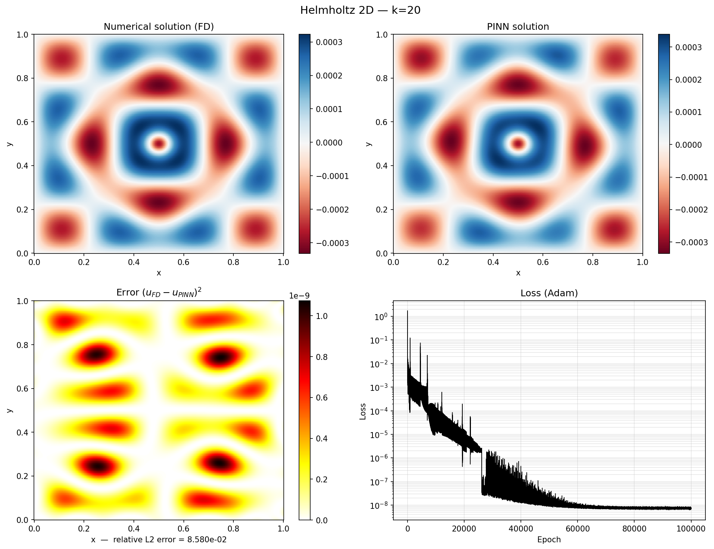 |

| k = 30 | k = 40 | k = 50 |
|:---:|:---:|:---:|
| 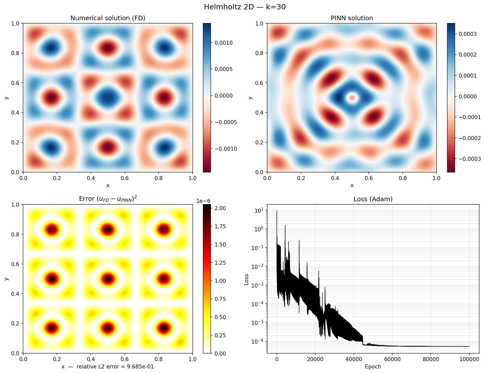 | 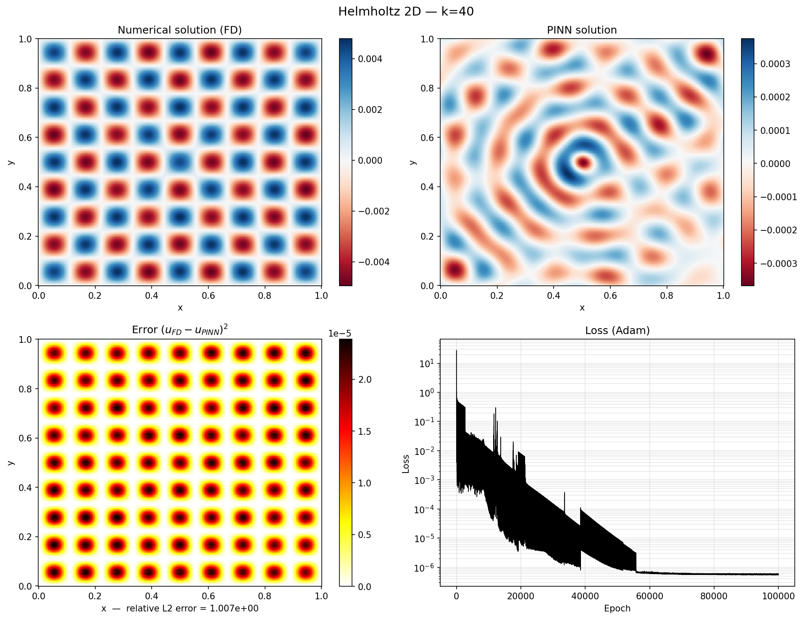 | 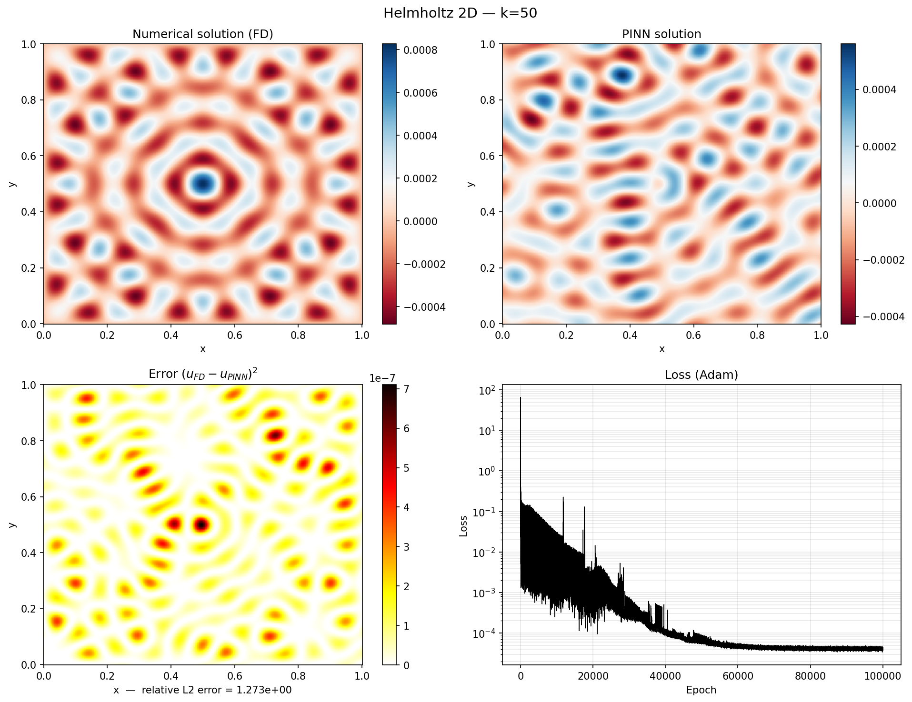 |

Each panel shows: the finite-difference reference, the PINN prediction, the pointwise squared error, and the training loss curve.

---

## Dependencies

```
torch
numpy
scipy
matplotlib
tqdm
```

---

## Final note

These scripts were written for learning and exploration. No result has been validated in a real application context. Hyperparameters (network width, training duration, loss weighting) were chosen empirically and are not optimized.
