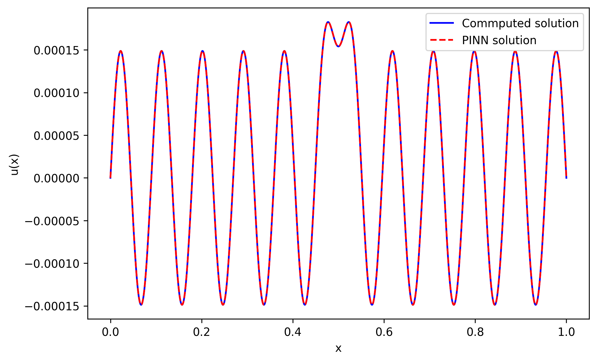

# helmholtz-PINN-experiments

> ⚠️ **Personal repository.**
> The scripts in this repository were written for learning purposes. The results do not claim to represent any physical reality.

---

## Overview

This repository gathers experiments with **Physics-Informed Neural Networks (PINNs)** applied to two classical PDEs: the **Helmholtz equation** and a **1D wave scattering problem**.

All models use a **SIREN** (*Sinusoidal Representation Network*) architecture, whose sinusoidal activations are well-suited for learning oscillatory solutions. Parts of the implementation and project organization are inspired by the PINN-based Helmholtz solver by songc0a.


---

## Scripts

### `DIFFUSION_1D.py` — 1D Scattering by a dielectric interface

**Physical setup.** An incident plane wave propagates from left to right and hits a dielectric interface with refractive index `n_d = 1.5`, located between `x = 0.35` and `x = 0.65`. At each interface, part of the wave is reflected and part is transmitted.


The total field is split into the known incident field and the unknown scattered field. The PINN learns only the scattered field, decomposed into real and imaginary parts.

**Results:**

| k = 5 | k = 10 |
|:---:|:---:|
|  |  |

| k = 15 | k = 20 |
|:---:|:---:|
|  |  |

---

### `HELM_PINN_1D.py` — 1D Helmholtz with a localized source

**Physical setup.** The stationary Helmholtz equation on a segment, domain [0, 1].

**Results:**

<table>
<tr>
<td><br><em>k = 10</em></td>
<td><br><em>k = 70</em></td>
<td><br><em>k = 100</em></td>
</tr>
</table>

---

### `HELM_PINN_2D.py` — 2D Helmholtz equation

**Physical setup.** Extension to a 2D domain.


**Results:**

| k = 5 | k = 10 | k = 20 |
|:---:|:---:|:---:|
|  |  |  |

| k = 30 | k = 40 | k = 50 |
|:---:|:---:|:---:|
|  |  |  |

Each panel shows: the finite-difference reference, the PINN prediction, the pointwise squared error, and the training loss curve.

---

## Dependencies

```
torch
numpy
scipy
matplotlib
tqdm
```

